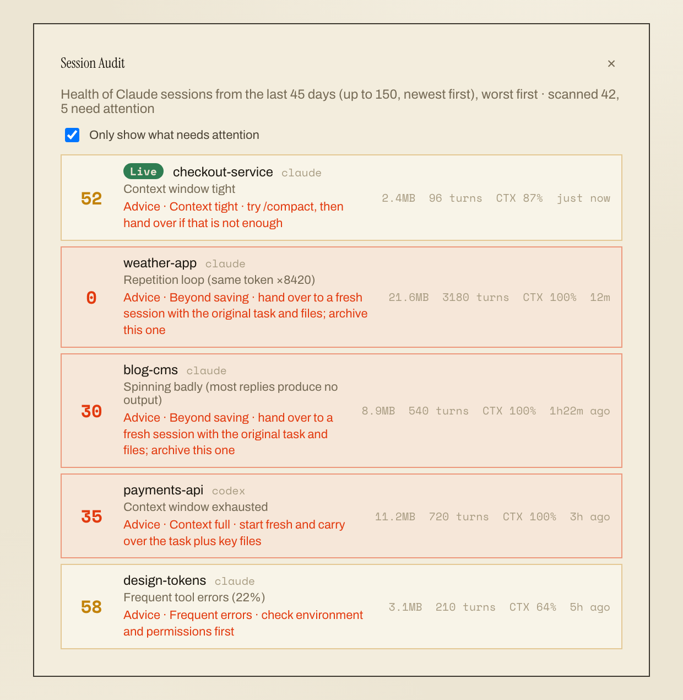
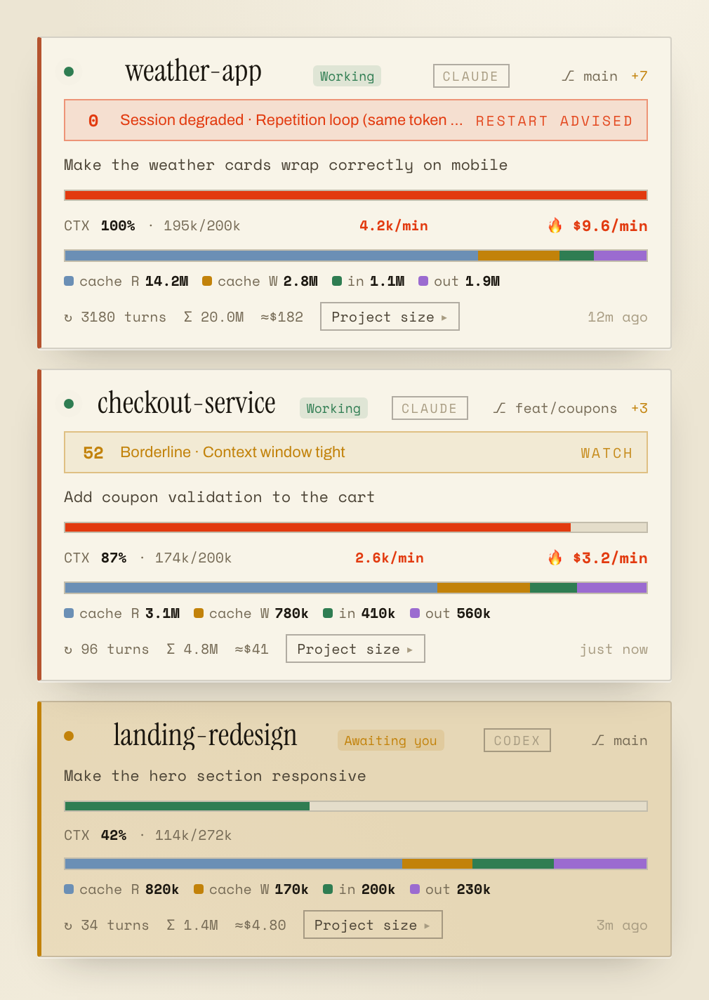
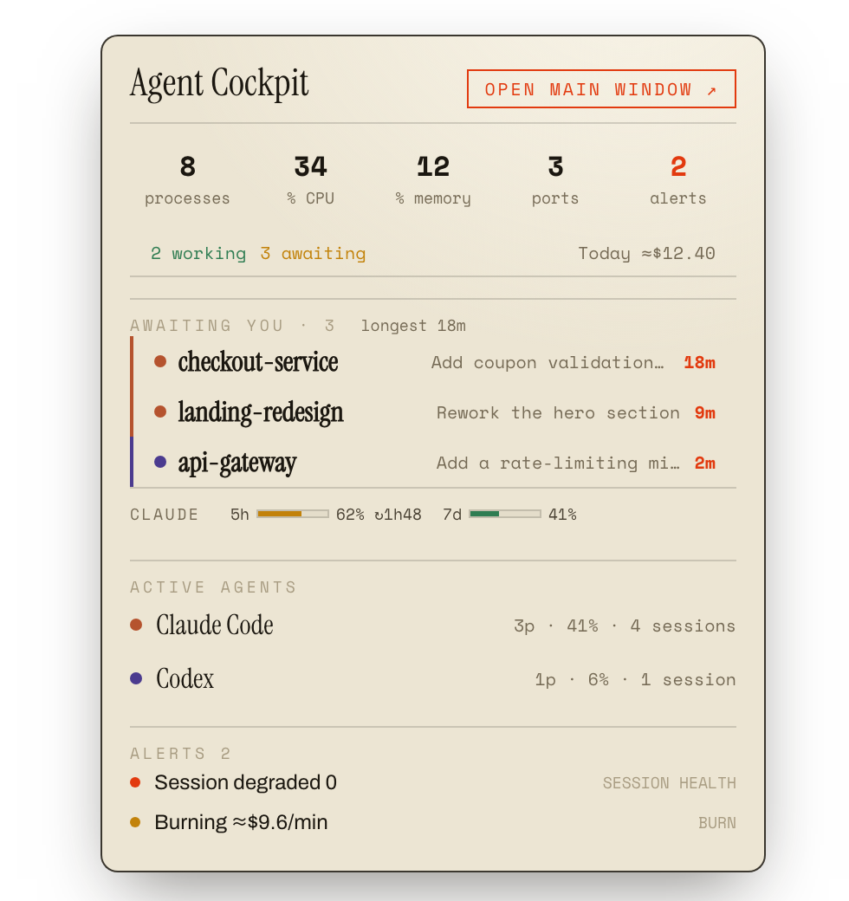

<div align="center">

# Agent Cockpit

**Observability for your local AI coding agents.**

Not just which agents are running, but which sessions have gone bad,
and whether to salvage them or start over.

[](https://github.com/jokerailab/agent-cockpit/actions/workflows/ci.yml)
[](LICENSE)

[](https://github.com/jokerailab/agent-cockpit/releases)

[English](README.md) · [简体中文](README.zh-CN.md)



</div>

---

## Why

A coding agent doesn't fail loudly. It fails by slowly becoming useless.

It starts replying without producing anything. It repeats one token four thousand
times. It burns through its context window on a transcript it can no longer use.
From the outside, all three look identical to a session that is still working, so
you keep typing "continue" while every turn costs real money and the transcript
rots further.

The right move is usually to abandon that session and hand the task to a fresh
one. But that only helps if you know *which* session is rotten and *why*.

Agent Cockpit scores every recent session from 0 to 100, names the single problem
worth acting on, and tells you whether to compact, hand over, or walk away. It
runs in your menu bar and keeps watching after you close the window.

## What it does

**Session health scoring.** Ten rules over your session logs detect context
blowout, spinning (turns that produce nothing), repetition loops, tool-error
storms, compaction thrashing, and stall patterns. Each session gets a score, one
headline diagnosis, and concrete advice. The full model, including its calibration
data and known false positives, is documented in
[docs/HEALTH-MODEL.md](docs/HEALTH-MODEL.md).

**Guardian notifications.** The one that earns its keep: a notification when an
agent finishes its turn and is waiting on you. Also fires for high burn rate,
approaching rate limits, runaway processes and orphaned dev servers. Works with
the window closed.

**Cost and quota, honestly framed.** Equivalent API cost at published rates, 5h
and 7d rate-limit windows, and per-minute burn rate. If you're on a subscription
it reports equivalent value and plan payback rather than pretending you were
billed per token. Unknown models show `—` instead of a guess.

**Auto-discovery.** Detects 17 agents with no configuration. Adding another is one
entry in one array: [docs/ADDING-AN-AGENT.md](docs/ADDING-AN-AGENT.md).

**Live process monitoring.** Process tree with agent attribution (it resolves
`node` back to the agent that spawned it), CPU normalised to a share of the whole
machine, listening ports, orphan dev-server detection, and one-click kill.

<div align="center">


</div>

## Privacy

This app reads your session logs, which contain your conversations. So:

**It makes no network requests at all.** No telemetry, no analytics, no crash
reporting, no update check, no account. Everything stays in a local SQLite file.

Don't take that on trust, check it:

```bash
grep -rnE "fetch\(|axios|https?://|net\.request|WebSocket" src/
```

The only hit is an SVG XML namespace in a stylesheet. The sole runtime
dependencies are `better-sqlite3` and `systeminformation`; there is no HTTP client
in the tree.

Conversation text is parsed in memory for scoring and never written to disk. The
database stores only numbers. Full read/write inventory: [PRIVACY.md](PRIVACY.md).

## Install

Download the latest `.dmg` from
[Releases](https://github.com/jokerailab/agent-cockpit/releases) and drag it to
Applications.

The app is signed ad-hoc, not notarised with a paid Apple Developer certificate.
So on first launch macOS will refuse to open it. This is expected and takes one
extra step:

1. Double-click the app. macOS says it "cannot be verified" or "is damaged".
2. Open **System Settings → Privacy & Security**, scroll down.
3. Find Agent Cockpit and click **Open Anyway**.

That's once, not every launch. If you'd rather not trust a binary, build it
yourself: `npm install && npm run dist:mac`.

## Platform support

| Platform | Status |
| --- | --- |
| macOS (arm64, x64) | ✅ Supported and used daily |
| Windows | ⚠️ Builds and typechecks in CI, never run by the author. PRs welcome |
| Linux | ⚠️ Same. AppImage target is configured but unverified |

Being straight about this: the discovery layer has platform-specific paths for
Windows and Linux and the build targets exist, but nobody has confirmed the app
actually works there. If you try it, an issue either way is useful.

## Supported agents

| | | |
| --- | --- | --- |
| Claude Code `†` | Codex `†` | Gemini CLI |
| Cursor | Windsurf | Antigravity |
| opencode | Aider | Goose |
| Amp | Cline | Continue |
| Qwen Code | 通义灵码 Lingma | CodeBuddy |
| Trae | CodeGeeX | |

`†` Session introspection (context, tokens, cost). Health scoring is Claude Code
only, because it's the only log format that exposes per-turn signals; see
[the model's limits](docs/HEALTH-MODEL.md#known-limits-and-false-positives).
Everything else gets detection, process attribution and resource monitoring,
which the UI states explicitly rather than showing zeros.

## Development

```bash
npm install
npm run rebuild    # rebuild better-sqlite3 against the Electron ABI
npm run dev        # Electron + renderer HMR
npm run verify     # typecheck + i18n guard + tests (the CI gate)
npm test           # unit tests only
npm run build      # build all three processes to out/
npm run dist:mac   # package a dmg
```

Requires Node 20+.

`npm run rebuild` is needed because `better-sqlite3` is a native module: npm
installs a prebuilt binary for your Node runtime, but Electron ships a different
ABI (and npm sometimes fetches the wrong CPU architecture outright). If you skip
it, the app launches but every database call fails with
`incompatible architecture` or `NODE_MODULE_VERSION`. Re-run it after any
`npm install` that touches the lockfile. Packaging handles this automatically via
`npmRebuild`.

## Documentation

- [Architecture](docs/ARCHITECTURE.md) — process layout, the IPC contract, the
  incremental log reader, attribution, storage
- [Health model](docs/HEALTH-MODEL.md) — every rule, its calibration, and where it
  is wrong
- [Adding an agent](docs/ADDING-AN-AGENT.md) — the 5-minute contribution
- [Privacy](PRIVACY.md) — exactly what is read and written
- [Contributing](CONTRIBUTING.md)

## License

MIT © 乔氪智造 (Joker AI Lab)
